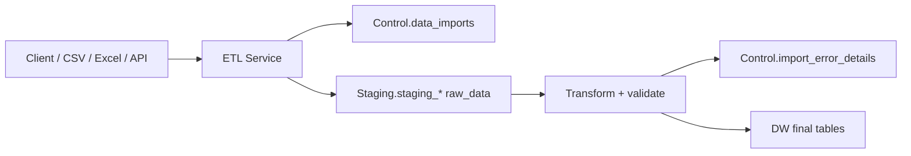

# ETL Service Architecture

## Purpose

This service isolates the import workload from the main backend. The backend can upload a file
and create an import, while this service validates rows, writes staging records, loads the DW, and
keeps row-level errors traceable.

## Flow



## Layers

- `api`: optional HTTP surface for the main backend.
- `workers`: CLI entrypoints and future background workers.
- `services`: orchestration of import use cases.
- `repositories`: SQL access for Control, Staging and DW.
- `etl`: registry, loaders, transformers and validators.
- `core`: settings and logging.
- `db`: database connection and SQL identifier helpers.

## Process reporting

The ETL orchestration accepts a `ProcessReporter` from `core.progress`.
This keeps process visibility separate from business logic:

- API and background workers can use the default no-op reporter.
- CLI commands pass `workers.console_progress.ConsoleProcessReporter`.
- Future reporters can send events to logs, metrics, websockets, or a job dashboard without
  changing the staging, validation, or DW loading code.

## Processing semantics

Staging rows use the existing columns:

- `is_valid = false`, `is_processed = false`: raw row not validated yet.
- `is_valid = false`, `is_processed = true`: invalid row or load failure.
- `is_valid = true`, `is_processed = false`: valid row waiting for DW load.
- `is_valid = true`, `is_processed = true`: loaded into DW.

This keeps the current table structure usable without adding `row_status`.

## Adding a new import type

1. Add an `ImportSpec` in `src/etl_service/etl/registry.py`.
2. Add aliases in `src/etl_service/etl/transformers/common.py`.
3. Add custom validation in `src/etl_service/etl/validators/common.py` if needed.
4. Create the matching `Staging.staging_*` table.

## Schema settings

The service does not hardcode `public` as the only final schema.

Use `.env`:

```text
DW_SCHEMA=public
CONTROL_SCHEMA=Control
STAGING_SCHEMA=Staging
```

If your final tables are moved to `"Data_Warehouse"`, change:

```text
DW_SCHEMA=Data_Warehouse
```
